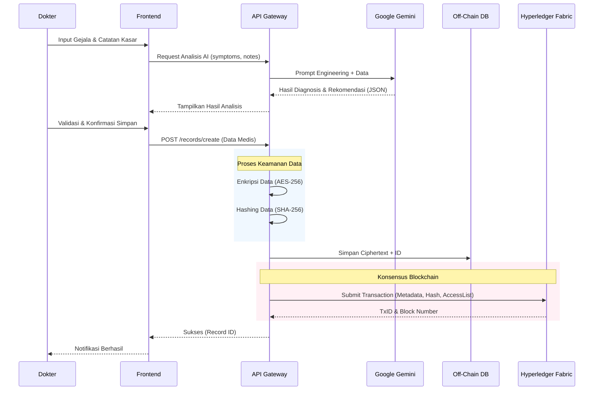
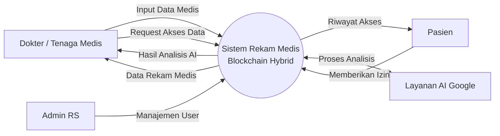
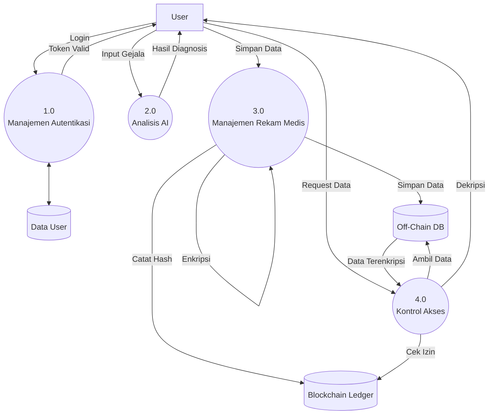
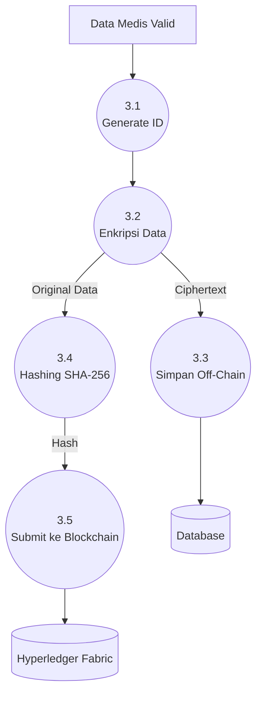
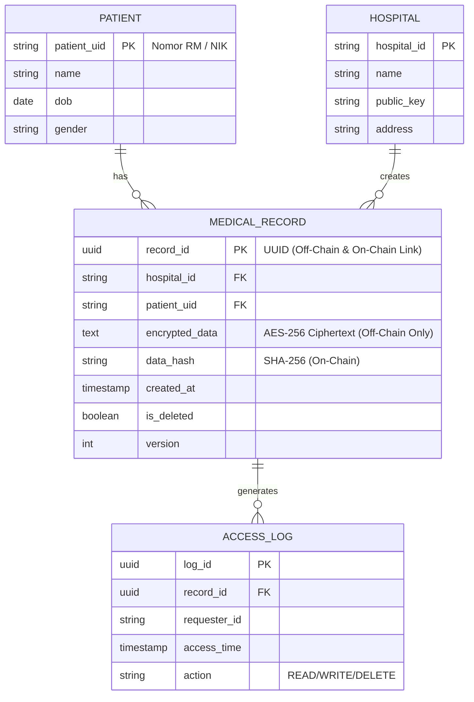

# Diagram Arsitektur dan Alur Sistem National Health Record Ledger

Dokumen ini berisi representasi visual dari arsitektur sistem, alur kerja, dan model data berdasarkan implementasi teknis saat ini.

---

## 1. Arsitektur Sistem (System Architecture)

Diagram ini menggambarkan interaksi antara komponen utama: Frontend (React), Backend API (Node.js), layanan eksternal (AI), dan jaringan Blockchain (Hyperledger Fabric).

```mermaid
graph TD
    User[Dokter / Admin RS] -->|HTTPS| Frontend[Frontend React (Vite)]

    subgraph "Off-Chain Layer (Private)"
        Frontend -->|REST API| APIGateway[API Gateway (Node.js)]
        APIGateway -->|Analisis Medis| AI[Google Gemini AI Service]
        APIGateway -->|Enkripsi AES-256| EncryptModule[Encryption Module]
        EncryptModule -->|Simpan Data Terenkripsi| DB[(Off-Chain Storage\nIn-Memory / PostgreSQL)]
    end

    subgraph "On-Chain Layer (Consortium)"
        APIGateway -->|Submit Hash & Metadata| FabricSDK[Fabric SDK]
        FabricSDK -->|Invoke Chaincode| Peer1[Peer Node (RS A)]
        FabricSDK -->|Invoke Chaincode| Peer2[Peer Node (RS B)]
        Peer1 <-->|Gossip| Peer2
        Peer1 -->|Order Transaction| Orderer[Orderer Node]
        Peer2 -->|Order Transaction| Orderer
    end

    classDef default fill:#f9f9f9,stroke:#333,stroke-width:2px;
    classDef blockchain fill:#e1f5fe,stroke:#01579b,stroke-width:2px;
    classDef storage fill:#fff3e0,stroke:#e65100,stroke-width:2px;

    class Peer1,Peer2,Orderer blockchain;
    class DB storage;
```

---

## 2. Workflow Sistem (System Workflow)

Alur kerja utama: **Pembuatan Rekam Medis Baru dengan Bantuan AI**.



---

## 3. Data Flow Diagram (DFD)

### Level 0 (Context Diagram)

Diagram konteks yang menunjukkan batasan sistem dan entitas eksternal.



### Level 1 (Sistem Utama)

Pecahan proses utama dalam sistem.



### Level 2 (Detail Proses 3.0 - Manajemen Rekam Medis)

Detail langkah teknis dalam penyimpanan rekam medis.



---

## 4. Entity Relationship Diagram (ERD)

Diagram ini menggambarkan struktur data logis, memisahkan data off-chain (lengkap) dan on-chain (metadata).



---

## 5. Use Case Diagram

Interaksi aktor dengan fitur-fitur sistem.

```mermaid
usecaseDiagram
    actor "Dokter" as Doc
    actor "Admin RS" as Admin
    actor "Sistem AI" as AI

    package "Sistem Rekam Medis Blockchain" {
        usecase "Login / Autentikasi" as UC1
        usecase "Input Data Pasien" as UC2
        usecase "Minta Analisis AI" as UC3
        usecase "Simpan Rekam Medis (Create)" as UC4
        usecase "Lihat Rekam Medis (Read)" as UC5
        usecase "Update Rekam Medis" as UC6
        usecase "Hapus Rekam Medis (Soft Delete)" as UC7
        usecase "Kelola Hak Akses" as UC8
    }

    Doc --> UC1
    Doc --> UC2
    Doc --> UC3
    Doc --> UC4
    Doc --> UC5
    Doc --> UC6
    Doc --> UC7

    Admin --> UC1
    Admin --> UC8

    UC3 <.. AI : "Generate Diagnosis"
    UC4 ..> UC3 : "<<include>>"
    UC4 --> UC8 : "<<update>> Access List"
```
