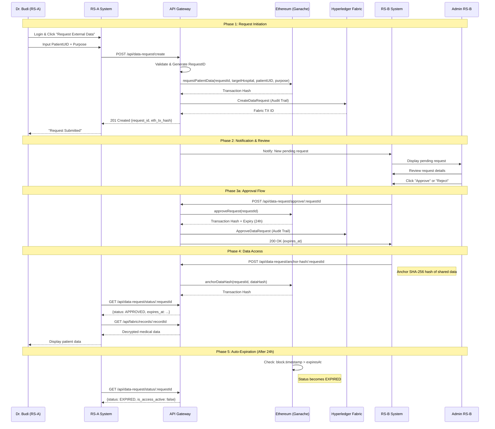
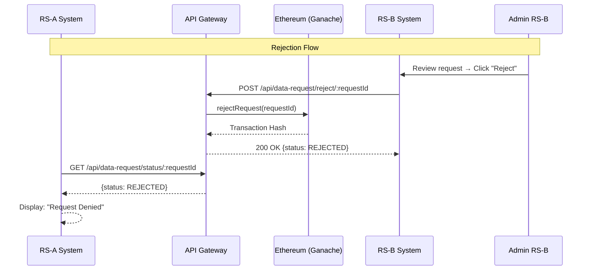
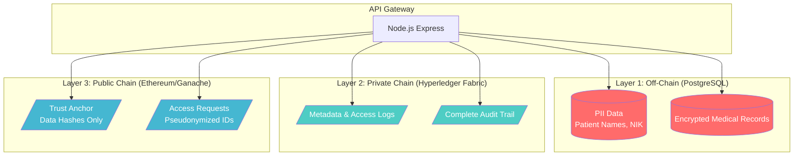
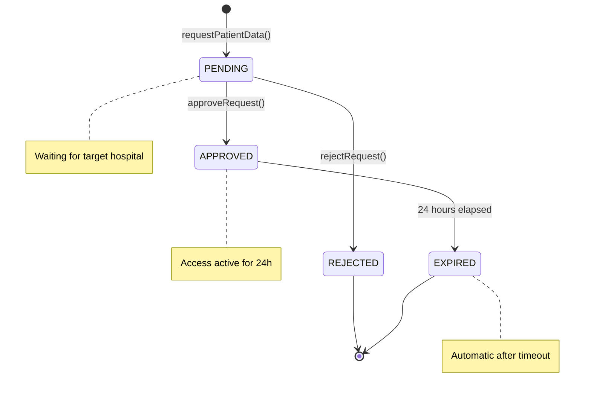

# Transaction Flow Diagram

## Cross-Hospital Data Request Workflow

---

## Alternative Flow: Request Rejection

---

## Data Flow Architecture

---

## State Machine: Request Lifecycle

---

## What Goes On-Chain vs Off-Chain

| Data Type | Storage | Reason |
|-----------|---------|--------|
| Patient Name | ❌ Off-chain (PostgreSQL) | PII - GDPR |
| NIK / ID Asli | ❌ Off-chain (PostgreSQL) | PII - GDPR |
| Medical Records | ❌ Off-chain (PostgreSQL) | Sensitive health data |
| PatientUID (hashed) | ✅ On-chain (Ethereum) | Pseudonymized |
| Hospital IDs | ✅ On-chain (Ethereum) | Non-sensitive |
| Request Status | ✅ On-chain (Ethereum) | Immutable audit |
| Data Hash (SHA-256) | ✅ On-chain (Ethereum) | Integrity verification |
| Timestamps | ✅ On-chain (Ethereum) | Tamper-proof logging |
| Full Audit Trail | ✅ On-chain (Fabric) | Detailed consortium logs |
